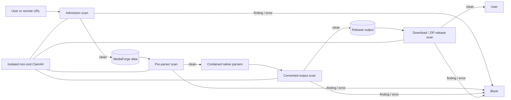

# Selected: explicit admission and release gates

```mermaid
flowchart LR
  U[User or remote URL] --> S1[Admission scan]
  S1 -->|clean| Q[(MediaForge data)]
  S1 -->|finding / error| B[Block]
  Q --> S2[Pre-parser scan]
  S2 -->|clean| P[Contained native parsers]
  S2 -->|finding / error| B
  P --> S3[Converted-output scan]
  S3 -->|clean| O[(Release output)]
  S3 -->|finding / error| B
  O --> S4[Download / ZIP release scan]
  S4 -->|clean| R[User]
  S4 -->|finding / error| B
  C[Isolated non-root ClamAV] --- S1
  C --- S2
  C --- S3
  C --- S4
```
