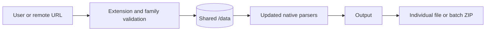

# Alternative: validation and updates only

```mermaid
flowchart LR
  U[User or remote URL] --> V[Extension and family validation]
  V --> D[(Shared /data)]
  D --> P[Updated native parsers]
  P --> O[Output]
  O --> R[Individual file or batch ZIP]
```

This alternative reduces incompatible input but has no malware decision point.
