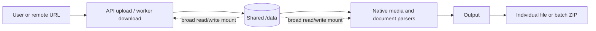

# Before: implicit trust after storage

```mermaid
flowchart LR
  U[User or remote URL] --> A[API upload / worker download]
  A --> D[(Shared /data)]
  D --> P[Native media and document parsers]
  P --> O[Output]
  O --> R[Individual file or batch ZIP]
  D -. broad read/write mount .-> A
  D -. broad read/write mount .-> P
```
